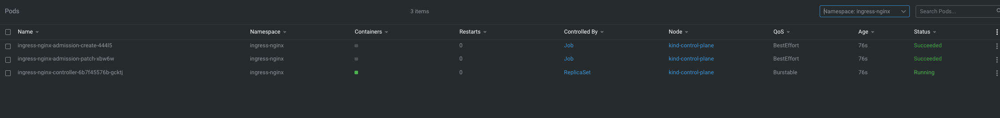
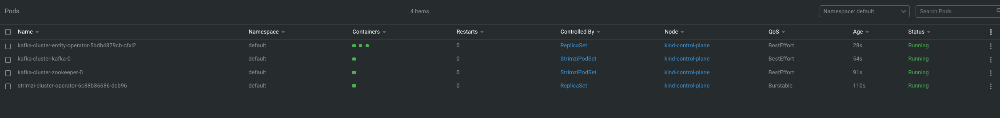

# Spring Boot application Apache Kafka producer template

This project is a simple Spring Boot application that uses Apache Kafka producer template to send messages to a Kafka topic.

## Requirements
- [mvn](https://maven.apache.org/index.html)
- [Java JDK 17](https://www.oracle.com/de/java/technologies/downloads/#java17) or greater.
- [docker](https://www.docker.com/)
- [kind](https://kind.sigs.k8s.io/)
- [kubectl](https://kubernetes.io/docs/reference/kubectl/)
- [make](https://formulae.brew.sh/formula/make)

## How to run
1. Create a local Kubernetes cluster using kind
```shell
make setup
```
This will do the following: 
- mvn local build of the maven project
- This will create a local Kubernetes cluster using kind.
- Load the built docker image into the local Kubernetes cluster. (Step is Required with kind)
2. Install Ingress Controller in Kubernetes cluster
```shell
make ingress-controller
```
This will install Nginx Ingress Controller in Kubernetes cluster. This step will take some time, we need to wait until the ingress controller is ready. That is when the below pods are created in the Kubernetes cluster under namespace `ingress-nginx`.

3. Setup the Ingress for Kubernetes cluster.
```shell
make ingress
```
4. Setup Kafka in Kubernetes cluster
```shell
make kafka
```
This will install Kafka in Kubernetes cluster. This step will take some time, we need to wait until the Kafka cluster is ready.
The below pods would be created in the Kubernetes cluster. To mark the completion of Kafka Setup

5. Deploy the Spring Boot application and its associated Load Balancer service in Kubernetes cluster.
```shell
make deploy
```

### Delete Cluster
```shell
make delete-cluster
```

## Check if the application is running
You should be able to see the below-mentioned logs in the console. The scheduled job will send a message to the Kafka topic every 10 seconds.
```shell
kubectl logs kafka-template-app-{suffix-ids}
```

```shell
  .   ____          _            __ _ _
 /\\ / ___'_ __ _ _(_)_ __  __ _ \ \ \ \
( ( )\___ | '_ | '_| | '_ \/ _` | \ \ \ \
 \\/  ___)| |_)| | | | | || (_| |  ) ) ) )
  '  |____| .__|_| |_|_| |_\__, | / / / /
 =========|_|==============|___/=/_/_/_/
 :: Spring Boot ::                (v3.1.3)

2023-09-07T15:46:58.684Z  INFO 1 --- [           main] c.s.d.i.kafka.KafkaTemplateApplication   : Starting KafkaTemplateApplication v0.0.1-SNAPSHOT using Java 17.0.2 with PID 1 (/app.jar started by root in /)
2023-09-07T15:46:58.686Z  INFO 1 --- [           main] c.s.d.i.kafka.KafkaTemplateApplication   : No active profile set, falling back to 1 default profile: "default"
2023-09-07T15:46:59.345Z  INFO 1 --- [           main] o.s.b.w.embedded.tomcat.TomcatWebServer  : Tomcat initialized with port(s): 8080 (http)
2023-09-07T15:46:59.357Z  INFO 1 --- [           main] o.apache.catalina.core.StandardService   : Starting service [Tomcat]
2023-09-07T15:46:59.358Z  INFO 1 --- [           main] o.apache.catalina.core.StandardEngine    : Starting Servlet engine: [Apache Tomcat/10.1.12]
2023-09-07T15:46:59.442Z  INFO 1 --- [           main] o.a.c.c.C.[Tomcat].[localhost].[/]       : Initializing Spring embedded WebApplicationContext
2023-09-07T15:46:59.443Z  INFO 1 --- [           main] w.s.c.ServletWebServerApplicationContext : Root WebApplicationContext: initialization completed in 719 ms
2023-09-07T15:46:59.888Z  INFO 1 --- [           main] o.s.b.w.embedded.tomcat.TomcatWebServer  : Tomcat started on port(s): 8080 (http) with context path ''
2023-09-07T15:46:59.899Z  INFO 1 --- [           main] c.s.d.i.kafka.KafkaTemplateApplication   : Started KafkaTemplateApplication in 1.665 seconds (process running for 2.094)
2023-09-07T15:46:59.911Z  INFO 1 --- [   scheduling-1] o.a.k.clients.producer.ProducerConfig    : ProducerConfig values: 
        acks = -1
        auto.include.jmx.reporter = true
        batch.size = 16384
        bootstrap.servers = [kafka-cluster-kafka-bootstrap:9092]
        buffer.memory = 33554432
        client.dns.lookup = use_all_dns_ips
        client.id = producer-1
        compression.type = none
        connections.max.idle.ms = 540000
        delivery.timeout.ms = 120000
        enable.idempotence = true
        interceptor.classes = []
        key.serializer = class org.apache.kafka.common.serialization.StringSerializer
        linger.ms = 0
        max.block.ms = 60000
        max.in.flight.requests.per.connection = 5
        max.request.size = 1048576
        metadata.max.age.ms = 300000
        metadata.max.idle.ms = 300000
        metric.reporters = []
        metrics.num.samples = 2
        metrics.recording.level = INFO
        metrics.sample.window.ms = 30000
        partitioner.adaptive.partitioning.enable = true
        partitioner.availability.timeout.ms = 0
        partitioner.class = null
        partitioner.ignore.keys = false
        receive.buffer.bytes = 32768
        reconnect.backoff.max.ms = 1000
        reconnect.backoff.ms = 50
        request.timeout.ms = 30000
        retries = 2147483647
        retry.backoff.ms = 100
        sasl.client.callback.handler.class = null
        sasl.jaas.config = null
        sasl.kerberos.kinit.cmd = /usr/bin/kinit
        sasl.kerberos.min.time.before.relogin = 60000
        sasl.kerberos.service.name = null
        sasl.kerberos.ticket.renew.jitter = 0.05
        sasl.kerberos.ticket.renew.window.factor = 0.8
        sasl.login.callback.handler.class = null
        sasl.login.class = null
        sasl.login.connect.timeout.ms = null
        sasl.login.read.timeout.ms = null
        sasl.login.refresh.buffer.seconds = 300
        sasl.login.refresh.min.period.seconds = 60
        sasl.login.refresh.window.factor = 0.8
        sasl.login.refresh.window.jitter = 0.05
        sasl.login.retry.backoff.max.ms = 10000
        sasl.login.retry.backoff.ms = 100
        sasl.mechanism = GSSAPI
        sasl.oauthbearer.clock.skew.seconds = 30
        sasl.oauthbearer.expected.audience = null
        sasl.oauthbearer.expected.issuer = null
        sasl.oauthbearer.jwks.endpoint.refresh.ms = 3600000
        sasl.oauthbearer.jwks.endpoint.retry.backoff.max.ms = 10000
        sasl.oauthbearer.jwks.endpoint.retry.backoff.ms = 100
        sasl.oauthbearer.jwks.endpoint.url = null
        sasl.oauthbearer.scope.claim.name = scope
        sasl.oauthbearer.sub.claim.name = sub
        sasl.oauthbearer.token.endpoint.url = null
        security.protocol = PLAINTEXT
        security.providers = null
        send.buffer.bytes = 131072
        socket.connection.setup.timeout.max.ms = 30000
        socket.connection.setup.timeout.ms = 10000
        ssl.cipher.suites = null
        ssl.enabled.protocols = [TLSv1.2, TLSv1.3]
        ssl.endpoint.identification.algorithm = https
        ssl.engine.factory.class = null
        ssl.key.password = null
        ssl.keymanager.algorithm = SunX509
        ssl.keystore.certificate.chain = null
        ssl.keystore.key = null
        ssl.keystore.location = null
        ssl.keystore.password = null
        ssl.keystore.type = JKS
        ssl.protocol = TLSv1.3
        ssl.provider = null
        ssl.secure.random.implementation = null
        ssl.trustmanager.algorithm = PKIX
        ssl.truststore.certificates = null
        ssl.truststore.location = null
        ssl.truststore.password = null
        ssl.truststore.type = JKS
        transaction.timeout.ms = 60000
        transactional.id = null
        value.serializer = class org.springframework.kafka.support.serializer.JsonSerializer

2023-09-07T15:46:59.949Z  INFO 1 --- [   scheduling-1] o.a.k.clients.producer.KafkaProducer     : [Producer clientId=producer-1] Instantiated an idempotent producer.
2023-09-07T15:46:59.972Z  INFO 1 --- [   scheduling-1] o.a.kafka.common.utils.AppInfoParser     : Kafka version: 3.4.1
2023-09-07T15:46:59.973Z  INFO 1 --- [   scheduling-1] o.a.kafka.common.utils.AppInfoParser     : Kafka commitId: 8a516edc2755df89
2023-09-07T15:46:59.973Z  INFO 1 --- [   scheduling-1] o.a.kafka.common.utils.AppInfoParser     : Kafka startTimeMs: 1694101619972
2023-09-07T15:47:00.353Z  WARN 1 --- [ad | producer-1] org.apache.kafka.clients.NetworkClient   : [Producer clientId=producer-1] Error while fetching metadata with correlation id 1 : {kafka-topic=LEADER_NOT_AVAILABLE}
2023-09-07T15:47:00.355Z  INFO 1 --- [ad | producer-1] org.apache.kafka.clients.Metadata        : [Producer clientId=producer-1] Cluster ID: Io74lkrJRSSISSWA7hlrZA
2023-09-07T15:47:00.356Z  INFO 1 --- [ad | producer-1] o.a.k.c.p.internals.TransactionManager   : [Producer clientId=producer-1] ProducerId set to 2 with epoch 0
2023-09-07T15:47:00.468Z  INFO 1 --- [ad | producer-1] org.apache.kafka.clients.Metadata        : [Producer clientId=producer-1] Resetting the last seen epoch of partition kafka-topic-0 to 0 since the associated topicId changed from null to 47PCDcyXT0mAkv4bM9Jkvg
2023-09-07T15:47:00.500Z  INFO 1 --- [   scheduling-1] c.s.d.i.k.config.KafkaProducerService    : Sent message='ping-1694101619894' to topic='kafka-topic'
2023-09-07T15:47:10.508Z  INFO 1 --- [   scheduling-1] c.s.d.i.k.config.KafkaProducerService    : Sent message='ping-1694101630502' to topic='kafka-topic'
2023-09-07T15:47:20.530Z  INFO 1 --- [   scheduling-1] c.s.d.i.k.config.KafkaProducerService    : Sent message='ping-1694101640516' to topic='kafka-topic'
2023-09-07T15:47:30.566Z  INFO 1 --- [   scheduling-1] c.s.d.i.k.config.KafkaProducerService    : Sent message='ping-1694101650548' to topic='kafka-topic'
2023-09-07T15:47:40.577Z  INFO 1 --- [   scheduling-1] c.s.d.i.k.config.KafkaProducerService    : Sent message='ping-1694101660572' to topic='kafka-topic'
2023-09-07T15:47:50.600Z  INFO 1 --- [   scheduling-1] c.s.d.i.k.config.KafkaProducerService    : Sent message='ping-1694101670590' to topic='kafka-topic'
2023-09-07T15:48:00.611Z  INFO 1 --- [   scheduling-1] c.s.d.i.k.config.KafkaProducerService    : Sent message='ping-1694101680604' to topic='kafka-topic'
2023-09-07T15:48:10.623Z  INFO 1 --- [   scheduling-1] c.s.d.i.k.config.KafkaProducerService    : Sent message='ping-1694101690615' to topic='kafka-topic'
```

## Open APIs
There are 2 open APIs present which can be used.
- `/v1/health`
```shell
curl --location 'http://localhost/v1/health'

Response:
{"health": "ok"}
```

- `/v1/message/{message}`
```shell
curl --location --request POST 'http://localhost/v1/message/ping-test'

Response:
ping-test
```
